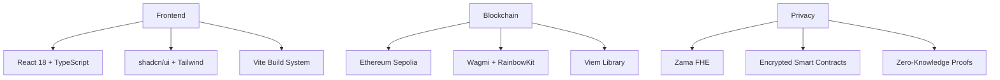

<div align="center">

# 🛡️ Dignified Loans

### *Privacy-First Microloan Platform with FHE Encryption*

[](https://opensource.org/licenses/MIT)
[](https://www.typescriptlang.org/)
[](https://reactjs.org/)
[](https://ethereum.org/)

*A revolutionary decentralized lending platform that protects your financial privacy through cutting-edge Fully Homomorphic Encryption technology.*

</div>

---

## 🌟 What Makes Us Different?

| Feature | Traditional Platforms | Dignified Loans |
|---------|----------------------|-----------------|
| **Privacy** | ❌ Data exposed to platform | ✅ FHE-encrypted data |
| **Transparency** | ❌ Black box algorithms | ✅ On-chain verifiable |
| **Security** | ❌ Centralized vulnerabilities | ✅ Decentralized architecture |
| **Access** | ❌ Geographic restrictions | ✅ Global accessibility |

## 🚀 Core Features

### 🔐 **Zero-Knowledge Privacy**
- **FHE Encryption**: Your financial data remains encrypted even during processing
- **Private Credit Scoring**: Credit assessments without exposing personal information
- **Anonymous Transactions**: Complete privacy while maintaining transparency

### 🌐 **Decentralized Architecture**
- **Smart Contracts**: Automated, trustless loan management
- **Ethereum Integration**: Built on Sepolia testnet for security
- **No Central Authority**: Peer-to-peer lending without intermediaries

### 💼 **Professional Tools**
- **Multi-Wallet Support**: Connect with RainbowKit, MetaMask, and more
- **Real-time Analytics**: Track loan performance with encrypted insights
- **Automated Repayments**: Smart contract-managed payment schedules

## 🛠️ Technology Stack



## ⚡ Quick Start

### Prerequisites
- **Node.js** 18+ 
- **npm** or **yarn**
- **Git**

### Installation

```bash
# 🎯 Clone the repository
git clone https://github.com/Harley-GH/dignified-loans.git
cd dignified-loans

# 📦 Install dependencies
npm install

# 🔧 Configure environment (see below)
cp .env.example .env

# 🚀 Start development server
npm run dev
```

### 🔑 Environment Setup

Create a `.env` file with your configuration:

```env
# 🌐 Network Configuration
VITE_CHAIN_ID=11155111
VITE_RPC_URL=https://sepolia.infura.io/v3/YOUR_INFURA_KEY
VITE_ALTERNATIVE_RPC_URL=https://1rpc.io/sepolia

# 🔗 Wallet Integration
VITE_WALLET_CONNECT_PROJECT_ID=YOUR_WALLET_CONNECT_PROJECT_ID

# 🔐 API Keys
VITE_INFURA_API_KEY=YOUR_INFURA_API_KEY
```

> 💡 **Need API keys?** Check our [Environment Setup Guide](./ENVIRONMENT_SETUP.md)

## 🏗️ Smart Contract Architecture

Our `DignifiedLoans.sol` contract implements:

```solidity
// 🔒 Encrypted loan management
struct LoanRequest {
    euint32 amount;        // FHE-encrypted amount
    euint32 interestRate;  // FHE-encrypted rate
    euint32 creditScore;   // FHE-encrypted score
    // ... other encrypted fields
}
```

### Key Features:
- **🔐 FHE-Encrypted Data**: All sensitive information is encrypted
- **📊 Privacy-Preserving Analytics**: Insights without data exposure
- **🔄 Automated Workflows**: Smart contract-managed processes
- **⭐ Reputation Systems**: Encrypted borrower/lender ratings

## 📁 Project Structure

```
dignified-loans/
├── 🎨 src/
│   ├── components/          # Reusable UI components
│   ├── config/             # Configuration & wallet setup
│   ├── hooks/              # Custom React hooks
│   ├── lib/                # Utility functions
│   └── pages/              # Application pages
├── 📜 contracts/           # Smart contract files
├── 🚀 public/              # Static assets
└── 📚 docs/                # Documentation
```

## 🚀 Deployment

### Vercel (Recommended)

[](https://vercel.com/new/clone?repository-url=https://github.com/Harley-GH/dignified-loans)

1. **Connect Repository**: Link your GitHub account to Vercel
2. **Set Environment Variables**: Add your API keys in Vercel dashboard
3. **Deploy**: Automatic deployment on every push to main

> 📖 **Detailed Guide**: See [DEPLOYMENT.md](./DEPLOYMENT.md) for step-by-step instructions

### Manual Deployment

```bash
# 🏗️ Build for production
npm run build

# 📤 Deploy dist/ folder to your hosting provider
```

## 🤝 Contributing

We welcome contributions! Here's how to get started:

1. **🍴 Fork** the repository
2. **🌿 Create** a feature branch (`git checkout -b feature/amazing-feature`)
3. **💾 Commit** your changes (`git commit -m 'Add amazing feature'`)
4. **📤 Push** to the branch (`git push origin feature/amazing-feature`)
5. **🔀 Open** a Pull Request

### Development Guidelines

- **Code Style**: Follow TypeScript best practices
- **Testing**: Add tests for new features
- **Documentation**: Update docs for API changes
- **Security**: Review FHE implementation carefully

## 📄 License

This project is licensed under the **MIT License** - see the [LICENSE](LICENSE) file for details.

## 🆘 Support & Community

- **🐛 Bug Reports**: [GitHub Issues](https://github.com/Harley-GH/dignified-loans/issues)
- **💬 Discussions**: [GitHub Discussions](https://github.com/Harley-GH/dignified-loans/discussions)
- **📧 Contact**: [Create an Issue](https://github.com/Harley-GH/dignified-loans/issues/new)

---

<div align="center">

**Built with ❤️ for financial privacy and dignity**

[⭐ Star this repo](https://github.com/Harley-GH/dignified-loans) • [🐛 Report Bug](https://github.com/Harley-GH/dignified-loans/issues) • [💡 Request Feature](https://github.com/Harley-GH/dignified-loans/issues)

</div>
